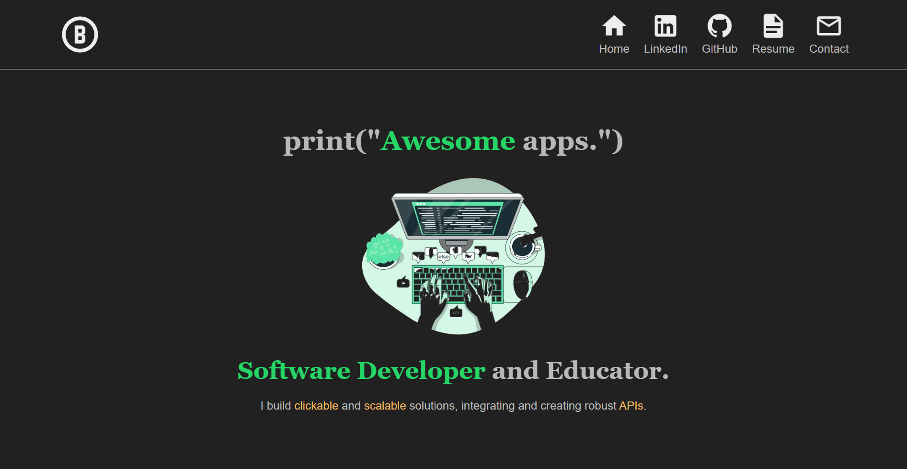

# Portfolio Website

I built my portfolio website with the intention of completing the [Cloud Resume Challenge](https://cloudresumechallenge.dev/docs/the-challenge/aws/), primarly with AWS services.

## Visit The Site

Feel free to check out the [project here](https://www.barronbytes.com/)!

## Prerequisites

Ensure that you have the following if attempting to complete the challenge as I did:

- [AWS account](https://aws.amazon.com/)
- [Cloudflare account](https://www.cloudflare.com/)

## The Cloud Resume Challenge – AWS Steps

This project consists of 16 steps, and I have completed the first six.

1. **Certification:** Obtained AWS Cloud Practitioner Certification.
2. **HTML:** Wrote accessible HTML for screen readers.
3. **CSS:** Achieved responsive design with custom variables, CSS Grid, and Flexbox.
4. **Static Website:** Utilized **AWS S3** bucket for file storage and static website hosting.
5. **HTTPS:** Purchased domain name with **Cloudflare** instead of AWS.
6. **DNS:** Via Cloudflare.
7. Javascript
8. Database
9. API
10. Python
11. Tests
12. Infrastructure as Code (IaC)
13. Source Control
14. CI/CD (Backend)
15. CI/CD (Frontend)
16. Blog Post
